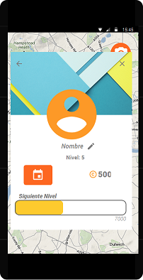
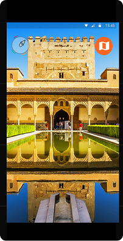
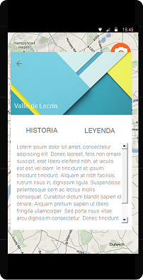
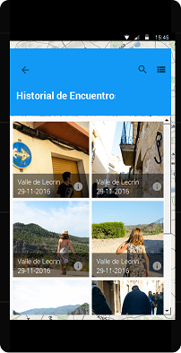
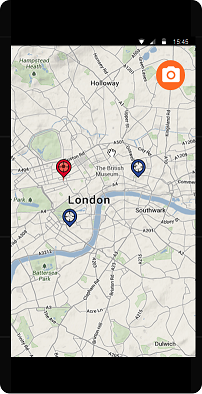
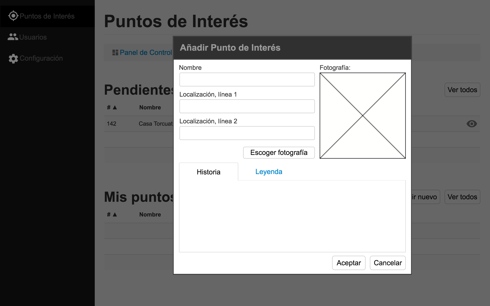
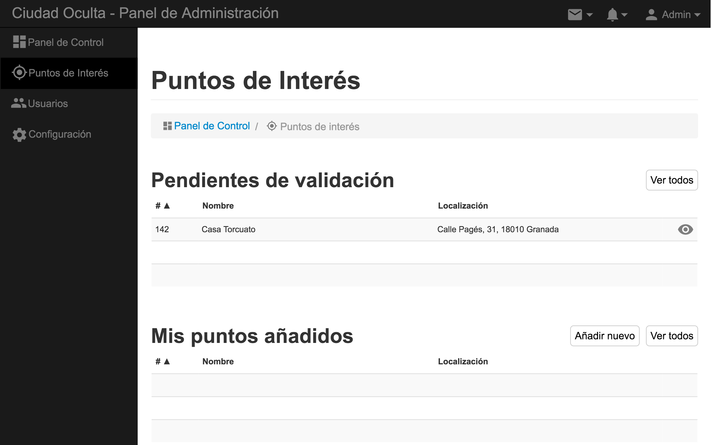
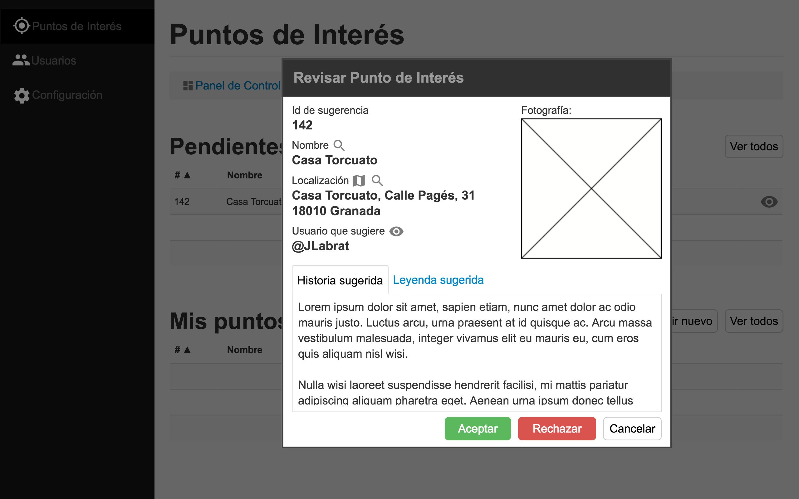
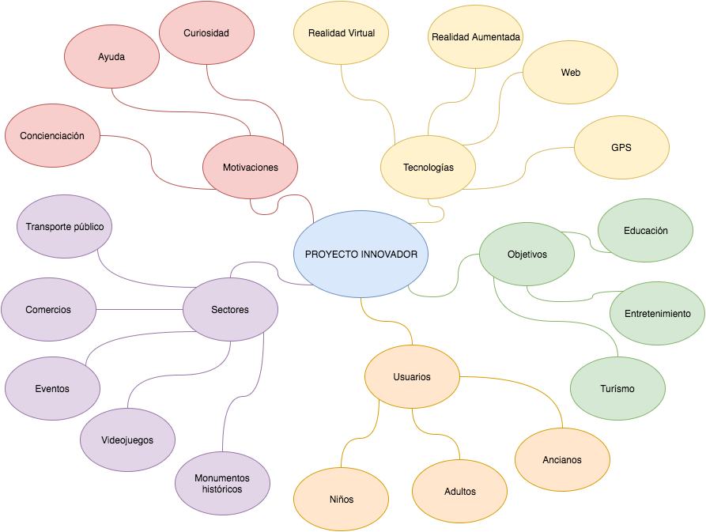

| [Producto:](#producto) | [Aplicación movil](#aplicacion) | [Panel de administración web](#administracion) | |
| [Desarrollo:](#desarrollo) | [Obtención de ideas](#ideas) | [Herramientas utilizadas](#herramientas) | [Integrantes del equipo](#equipo) | 
| | [Historias de Usuario](#historias-usuario) | [Sprints y entregas](#sprints-entregas) | [División en tareas](#tareas) |

# Ciudad oculta
> Con sumo placer presentamos una aplicación que revolucionará el turismo, permitiendo mayor dinamismo y acercando lugares inexplorados a todos aquellos que deseen perderse por las calles de las ciudades que visiten empapándose de la historia que los rodea. 

# 

## Producto

# 

### Descripción de la aplicación
**Ciudad Oculta** es una aplicación móvil desarrollada para android que permite al usuario disfrutar de lugares menos conocidos per igual de interesantes, de forma que pueda interactuar con su entorno descubriendo poco a poco las maravillas que pueda ofrecer la ciudad en la que se encuentra.
Para ello, la aplicación cuenta con dos modos, uno para usuarios registrados y otro para gente que solo desee probar la aplicación.

| Inicio de sesión | Perfil de usuario registrado |
| :-------------: | :-------------: |
|  |  

> La única diferencia entre estos dos métodos, es que en el modo usuario registado tendremos acceso a un perfil personal, de forma que podremos mantener un registro de nuestro avance en el juego, así como de disfrutar de descuentos en estabecimientos de la ciudad que participen en esta iniciativa gracias a los puntos que obtengamos.

**_¿Deseas capturar un punto?_** Nuestra aplicación tiene un modo de visualización en _RA_ que te poermitirá fotografiar el lugar y proporcionarte información. Está visualización en _RA_ te orientará con una brújula para que sepas hacia donde ir. Además, si te registras en la aplicación podrás volver a acceder a la información siempre que quieras.

| Visualizador de RA | Información de un lugar capturado | Historial de lugares visitados |
| :-------------: | :-------------: | :-------------: |
|  ||  |

Por supuesto, la aplicación cuenta tambien con una visualización en _modo mapa_ que nos premitirá situarnos en él, y ver que puntos tenemos cerca en un radio definido.

| Mapa |
|--------|--------|--------|
|  |

# 

### Apartado administrativo
Cada ciudad debe gestionar los lugares que permite. Para ello, hemos monstado una web en la que podrán fácilmente gestionar las sugerencias de lugares para que aparezcan en su aplicación.

> El motivo para desarrollar el aspecto administrativo de esta forma es a que el planteamiento de esta aplicación es _fomentar el turismo_ facilitando la información al viajante, por lo que la administración de sus puntos recae sobre la oficina de turismo, o del ayuntamiento que desee este servicio.

| Añadir punto de interés | Gestión de los puntos de interés | Sugerencias |
| :-------------: | :-------------: | :-------------: |
| |  |  |

# 

## Proceso de desarrollo
> En este apartado vamos a hablar sobre como él equipo se ha ido organizando para llevar a cabo las tareas asociadas al proyecto.

# 

### Obtención de ideas

Para decidir que hacer, el grupo opto por el uso del brainstorming para llegar a consenso sobre cual sería la idea ganadora. Tras varias ideas desechadas, finalmente llegamos a esta aplicación.

> Este mapa mental nos muestra como fue la evolución de las ideas para el proyecto.

Para decidir el nombre, se recurrió también a la técnica de brainstroming para obtener varios nombre y poder decidir cual es el más adecuado para la aplicación.

# 

### Herramientas utilizadas

* Kanban
* [Trello:](https://trello.com/b/6mIAsFnn/ciudad-oculta)
* [Google Drive:](https://goo.gl/hpRHmm)
* Justinmind 
* GitHub
* Haroopad

# 

### Intergantes y roles del equipo de desarrollo

A continuación mostramos a los integrantes del grupo de trabajo con sus respectivos roles asociados:

* José Antonio Martínez López - Coordinador
* Javier Labrat Rodríguez - Catalogador
* José Adrián Garrido Puertas - Moderador
* Javier Martínez Montilla - Presentador
* Samuel Peregrina Morillas - Gestor de Calidad

# 

### Historias de Usuario (HU) 

|Identificador|Título|Estimación|Prioridad|
| :-------------: | :-------------: | :-------------: | :-------------: |
|HU.1|Un invitado puede registrarse en la aplicación|3|2|
|HU.2|Un usuario/invitado puede localizar un punto de interés|5|1| 
|HU.3|Un usuario/invitado puede consultar un punto de interés|1|1| 
|HU.4|Un usuario/invitado puede leer una historia/leyenda de un punto de interés visitado|5|1| 
|HU.5|Un usuario/invitado puede escuchar una historia/leyenda de un punto de interés visitado|1|3|
|HU.6|Un usuario registrado puede consultar puntos de interés visitados|1/2|2|
|HU.7|Un usuario registrado puede consultar puntos de interés sin visitar por los que se haya pasado|1|2|
|HU.8|Un usuario registrado puede sugerir un punto de interés|8|1| 
|HU.9|Un usuario registrado puede consultar su perfil|1/2|1| 
|HU.10|Un usuario registrado puede consultar sus bonificaciones|1|2|
|HU.11|Un usuario registrado puede eliminar su registro|1/2|3|
|HU.12|Un usuario registrado puede consultar el estado de sus sugerencias|1/2|2|
|HU.13|Un usuario registrado puede eliminar una sugerencia|1/2|3|
|HU.14|Un usuario registrado puede editar una sugerencia|1/2|3|
|HU.15|Un usuario registrado puede identificarse|1|1| 
|HU.16|Un administrador puede añadir un punto de interés|2|1|
|HU.17|Un administrador puede consultar las estadísticas de un usuario|2|3|
|HU.18|Un administrador puede gestionar sugerencias de puntos de interés|3|1|
|HU.19|Un administrador puede aceptar una sugerencia de punto de interés|1/2|1| 
|HU.20|Un administrador puede rechazar una sugerencia de punto de interés|1/2|1| 
|HU.21|Un administrador puede reportar a un usuario|1|2|
|HU.22|Un administrador puede bloquear a un usuario|1/2|2|
|HU.23|Un administrador puede eliminar el registro de un usuario|1/2|2|
|HU.24|Un administrador puede consultar el perfil de un usuario|1/2|2|
|HU.25|Un administrador puede identificarse|1/2|1| 
|HU.26|Un usuario/invitado puede seguir a través de la aplicación cualquier red social de comercios asociados.|2|3|
|HU.27|Un usuario puede publicar en las redes sociales sus progresos.|3|3|
|HU.28|Un usuario puede publicar en las redes sociales sus puntos preferidos.|2|3|
|HU.29|Un usuario puede comparar su progreso con otro usuario. |8|3|
|HU.30|La aplicación publicará periódicamente un ranking con los puntos favoritos según la zona.|5|3|

> El cuadro anterior muestra las HU que se decidieron para este proyecto

# 

### Sprints y entregas

# 

### División de HU en función del sprint abordado

La división en tareas se hizo siempre al iniciar un sprint, por lo que así será como las definamos aquí.

#### Primer Sprint
Para el primer sprint, las tareas seleccionadas fueron "HU.3", "HU.3" y "HU.4".

| |Historia de Usuario 2| | |
| :-------------: | :-------------: | :-------------: | :-------------: |
|Identificador|Título|Estimación|Desarrollador asignado|
|Tarea 2-1|Diseño del boceto en papel de la IU para visualización de puntos geográficos|4|José Adrián Garrido Puertas|
|Tarea 2-2|Diseño del boceto digital de la IU para visualización de puntos geográficos|4|Samuel Peregrina Morillas|
|Tarea 2-3|Implementación de la interacción de la IU para visualización de puntos geográficos|4|Javier Martínez Montilla|
|Tarea 2-4|Diseño del diagrama de flujo asociado a las funcionalidades de localización y visualización de puntos geográficos|4|Javier Labrat Rodríguez|
|Tarea 2-5|Diseño del diagrama de clases asociado a la base de datos para almacenamiento de puntos geográficos|4|José Antonio Martínez López| 
|Tarea 2-6|Implementación de la funcionalidad para visualización de puntos geográficos|5| -- |

# 

| |Historia de Usuario 4| | |
| :-------------: | :-------------: | :-------------: | :-------------: |
|Identificador|Título|Estimación|Desarrollador asignado|
|Tarea 4-1|Diseño del boceto en papel de la IU para visualización de información (historia/leyenda)|4|José Adrián Garrido Puertas|
|Tarea 4-2|Diseño del boceto digital de la IU para visualización de información (historia/leyenda)|4|Samuel Peregrina Morillas|
|Tarea 4-3|Implementación de la interacción de la IU para visualización de información (historia/leyenda)|4|Javier Martínez Montilla|
|Tarea 4-4|Diseño del diagrama de flujo asociado a la obtención de información (historias/leyendas) de la base de datos|4|Javier Labrat Rodríguez|
|Tarea 4-5|Diseño del diagrama de clases asociado a la base de datos para almacenamiento de información (historias/leyendas)|4|José Antonio Martínez López| 
|Tarea 4-6|Implementación de la funcionalidad para visualización de información (historia/leyenda)|5| -- |

# 

| |Historia de Usuario 3| | |
| :-------------: | :-------------: | :-------------: | :-------------: |
|Identificador|Título|Estimación|Desarrollador asignado|
|Tarea 3-1|Diseño del boceto en papel de la IU para visualización de información relacionada con el punto de interés|4|José Adrián Garrido Puertas|
|Tarea 3-2|Diseño del boceto digital de la IU para visualización de información relacionada con el punto de interés|4|Samuel Peregrina Morillas|
|Tarea 3-3|Implementación de la interacción de la IU para visualización de información relacionada con el punto de interés|4|Javier Martínez Montilla|
|Tarea 3-4|Diseño del diagrama de flujo asociado a la obtención de información relacionada con el punto de interés de la base de datos|4|Javier Labrat Rodríguez|
|Tarea 3-5|Diseño del diagrama de clases asociado a la base de datos para almacenamiento de información relacionada con el punto de interés|4|José Antonio Martínez López| 
|Tarea 3-6|Implementación de la funcionalidad para visualización de información relacionada con el punto de interés|5| -- |

#### Segundo Sprint
Para el segundo sprint, las tareas seleccionadas fueron "HU.8", "HU.19", "HU.20", "HU.9", "HU.15" y "HU.16".

| |Historia de Usuario 8| | |
| :-------------: | :-------------: | :-------------: | :-------------: |
|Identificador|Título|Estimación|Desarrollador asignado|
|Tarea 8-1|Especificación en grupo de las funcionalidades asociadas|0.5|Equipo|
|Tarea 8-2|Diseño del boceto en papel de la IU para la sugerencia de puntos de interés|5|José Adrián Garrido Puertas|
|Tarea 8-3|Diseño del boceto digital de la IU para la sugerencia de puntos de interés|5|Samuel Peregrina Morillas|
|Tarea 8-4|Implementación de la interacción de la IU para la sugerencia de puntos de interés|4|Javier Martínez Montilla|
|Tarea 8-5|Implementación de la funcionalidad para la sugerencia de puntos de interés|4| -- | 

# 

| |Historia de Usuario 19| | |
| :-------------: | :-------------: | :-------------: | :-------------: |
|Identificador|Título|Estimación|Desarrollador asignado|
|Tarea 19-1|Especificación en grupo de las funcionalidades asociadas|0.5|Equipo|
|Tarea 19-2|Diseño del boceto en papel de la IU para la sugerencia de puntos de interés|1|José Antonio Martínez López|
|Tarea 19-3|Diseño del boceto digital de la IU para la sugerencia de puntos de interés|1|José Antonio Martínez López|
|Tarea 19-4|Implementación de la interacción de la IU para la sugerencia de puntos de interés|1|José Antonio Martínez López|
|Tarea 19-5|Implementación de la funcionalidad para la sugerencia de puntos de interés|1| -- | 

# 

| |Historia de Usuario 20| | | 
| :-------------: | :-------------: | :-------------: | :-------------: |
|Identificador|Título|Estimación|Desarrollador asignado|
|Tarea 20-1|Especificación en grupo de las funcionalidades asociadas|0.5|Equipo|
|Tarea 20-2|Diseño del boceto en papel de la IU para la sugerencia de puntos de interés|1|José Antonio Martínez López|
|Tarea 20-3|Diseño del boceto digital de la IU para la sugerencia de puntos de interés|1|José Antonio Martínez López|
|Tarea 20-4|Implementación de la interacción de la IU para la sugerencia de puntos de interés|1|José Antonio Martínez López|
|Tarea 20-5|Implementación de la funcionalidad para la sugerencia de puntos de interés|1| -- | 

# 

| |Historia de Usuario 9| | |
| :-------------: | :-------------: | :-------------: | :-------------: |
|Identificador|Título|Estimación|Desarrollador asignado|
|Tarea 9-1|Especificación en grupo de las funcionalidades asociadas|0.5|Equipo|
|Tarea 9-2|Diseño del boceto en papel de la IU para la consulta del perfil del usuario|1|José Antonio Martínez López|
|Tarea 9-3|Diseño del boceto digital de la IU para la consulta del perfil del usuario|1|Javier Labrat Rodríguez|
|Tarea 9-4|Implementación de la interacción de la IU para la consulta del perfil del usuario|1|Javier Martínez Montilla|
|Tarea 9-5|Implementación de la funcionalidad para la consulta del perfil del usuario|1| -- | 

# 

| |Historia de Usuario 15| | |
| :-------------: | :-------------: | :-------------: | :-------------: |
|Identificador|Título|Estimación|Desarrollador asignado|
|Tarea 15-1|Especificación en grupo de las funcionalidades asociadas|0.5|Equipo|
|Tarea 15-2|Diseño del boceto en papel de la IU para la identificación de un usuario|1|Javier Labrat Rodríguez|
|Tarea 15-3|Diseño del boceto digital de la IU para la identificación de un usuario|1|Javier Labrat Rodríguez|
|Tarea 15-4|Implementación de la interacción de la IU para la identificación de un usuario|1|Javier Labrat Rodríguez|
|Tarea 15-5|Implementación de la funcionalidad para la identificación de un usuario|1| -- | 

# 

| |Historia de Usuario 16| | |
| :-------------: | :-------------: | :-------------: | :-------------: |
|Identificador|Título|Estimación|Desarrollador asignado|
|Tarea 16-1|Especificación en grupo de las funcionalidades asociadas|0.5|Equipo|
|Tarea 16-2|Diseño del boceto en papel de la IU para añadir un punto de interés por un administrador|2|José Adrián Garrido Puertas|
|Tarea 16-3|Diseño del boceto digital de la IU para añadir un punto de interés por un administrador|2|Samuel Peregrina Morillas|
|Tarea 16-4|Implementación de la interacción de la IU para añadir un punto de interés por un administrador|2|Javier Martínez Montilla|
|Tarea 16-5|Implementación de la funcionalidad para añadir un punto de interés por un administrador|2| -- |
