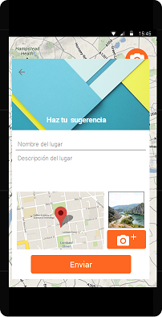

# Ciudad oculta
Con sumo placer presentamos una aplicación que revolucionará el turismo, permitiendo mayor dinamismo y acercando lugares inexplorados a todos aquellos que deseen perderse por las calles de las ciudades que visiten empapándose de la historia que los rodea. 

## Producto

### Visionado de la aplicación
Pasamos a mostrar el resultado final del proyecto.

| Inicio de la aplicación | Perfil de usuario | Lista de lugares visitados | Historia de un lugar visitado |
|--------|--------|--------|--------|
|  |  |  |  |

| Realidad aunmentada | Enviar sugerencias | Mapa |
|--------|--------|--------|
|  |  |  |

### Visualización de la web administrativa

Un pequeño texto

| Añadir punto de interás| Gestión de los puntos de interés | Sugerencias |
|--------|--------|--------|
| |  |  |

## Proceso de desarrollo