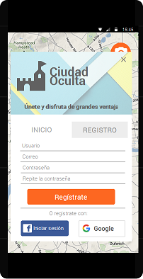

# Ciudad oculta
> Con sumo placer presentamos una aplicación que revolucionará el turismo, permitiendo mayor dinamismo y acercando lugares inexplorados a todos aquellos que deseen perderse por las calles de las ciudades que visiten empapándose de la historia que los rodea. 

## Producto

### Descripción de la aplicación
**Ciudad Oculta** es una aplicación móvil desarrollada para android que permite al usuario disfrutar de lugares menos conocidos per igual de interesantes, de forma que pueda interactuar con su entorno descubriendo poco a poco las maravillas que pueda ofrecer la ciudad en la que se encuentra.
Para ello, la aplicación cuenta con dos modos, uno para usuarios registrados y otro para gente que solo desee probar la aplicación.

| **Inicio de sesión** | **Perfil de usuario registrado** |
|--------|--------|
|  |  

> La única diferencia entre estos dos métodos, es que en el modo usuario registado tendremos acceso a un perfil personal, de forma que podremos mantener un registro de nuestro avance en el juego, así como de disfrutar de descuentos en estabecimientos de la ciudad que participen en esta iniciativa gracias a los puntos que obtengamos.

**_¿Deseas capturar un punto?_** Nuestra aplicación tiene un modo de visualización en _RA_ que te poermitirá fotografiar el lugar y proporcionarte información. Está visualización en _RA_ te orientará con una brújula para que sepas hacia donde ir. Además, si te registras en la aplicación podrás volver a acceder a la información siempre que quieras.

|**Visualizador de RA**|**Información de un lugar capturado**|**Historial de lugares visitados**|
|--------|--------|--------|
|  ||  |

Por supuesto, la aplicación cuenta tambien con una visualización en _modo mapa_ que nos premitirá situarnos en él, y ver que puntos tenemos cerca en un radio definido.

| **Mapa** |
|--------|--------|--------|
|  |

### Apartado administrativo
Cada ciudad debe gestionar los lugares que permite. Para ello, hemos monstado una web en la que podrán fácilmente gestionar las sugerencias de lugares para que aparezcan en su aplicación.

> El motivo para desarrollar el aspecto administrativo de esta forma es a que el planteamiento de esta aplicación es _fomentar el turismo_ facilitando la información al viajante, por lo que la administración de sus puntos recae sobre la oficina de turismo, o del ayuntamiento que desee este servicio.

| Añadir punto de interás| Gestión de los puntos de interés | Sugerencias |
|--------|--------|--------|
| |  |  |

## Proceso de desarrollo
> En este apartado vamos a hablar sobre como él equipo se ha ido organizando para llevar a cabo las tareas asociadas al proyecto.

### Obtención de ideas

Para decidir que hacer, el grupo opto por el uso del brainstorming para llegar a consenso sobre cual sería la idea ganadora. Tras varias ideas desechadas, finalmente llegamos a esta aplicación.

> Este mapa mental nos muestra como fue la evolución de las ideas para el proyecto.

Para decidir el nombre, se recurrió también a la técnica de brainstroming para obtener varios nombre y poder decidir cual es el más adecuado para la aplicación.

### Herramientas utilizadas

### Intergantes y roles del equipo de desarrollo

A continuación mostramos a los integrantes del grupo de trabajo con sus respectivos roles asociados:

* José Antonio Martínez López - Coordinador
* Javier Labrat Rodríguez - Catalogador
* José Adrián Garrido Puertas - Moderador
* Javier Martínez Montilla - Presentador
* Samuel Peregrina Morillas - Gestor de Calidad

### Historias de Ususario (HU)

### Sprints y entregas

### División de HU en función del sprint abordado
